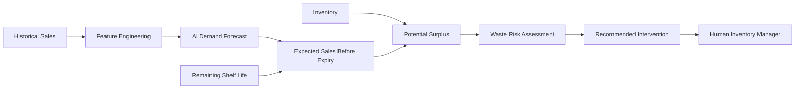

# ♻️ WasteWise AI

### AI-Powered Perishable Inventory Waste Prevention System

> A prototype decision-support system that combines **AI demand forecasting**, **shelf-life analysis**, and **inventory risk reasoning** to identify potential perishable inventory surplus before expiry.

[](https://www.python.org/)
[](https://streamlit.io/)
[](https://scikit-learn.org/)
[](https://scikit-learn.org/)
[](https://scikit-learn.org/stable/modules/ensemble.html#random-forests)
[](https://plotly.com/)
[](https://sdgs.un.org/goals/goal12)
[]()

🔗 **Live Demo:** [wastewise-ai-app.streamlit.app](https://wastewise-ai-app.streamlit.app/)
📄 **Full Responsible AI & data disclosure:** [RESPONSIBLE_AI.md](./RESPONSIBLE_AI.md)

---

## 📌 Table of Contents

- [Problem](#-problem)
- [Solution](#-solution)
- [How It Works](#️-how-it-works)
- [AI Component](#-ai-component)
- [Decision Logic](#-decision-logic)
- [Dashboard](#-dashboard)
- [Example](#-example)
- [Technology Stack](#️-technology-stack)
- [Dataset](#-dataset)
- [Repository Structure](#-repository-structure)
- [Getting Started](#-getting-started)
- [Limitations](#️-limitations)
- [Future Improvements](#-future-improvements)
- [SDG Alignment](#-sdg-alignment)
- [Contributing](#-contributing)
- [License](#-license)

---

## 🌍 Problem

Perishable products such as milk, yogurt, juice, and ready meals have a limited shelf life. When inventory exceeds the quantity likely to be sold before expiry, products can become potential waste.

Traditional inventory monitoring shows current stock, sales history, and reorder levels — but it doesn't clearly answer:

> **"How much of this inventory is likely to remain unsold before expiry?"**

---

## 💡 Solution

WasteWise AI combines **AI-based demand forecasting** with **inventory and shelf-life reasoning** to estimate future demand and compare it against inventory that may remain available before expiry — turning a reactive waste-tracking problem into an earlier, interpretable decision-support signal.

---

## ⚙️ How It Works



1. **Historical Sales** — daily sales organized by SKU
2. **Feature Engineering** — lag sales, rolling averages, day-of-week, promotion flag, SKU identity
3. **AI Demand Forecast** — a Random Forest model predicts expected daily demand
4. **Shelf-Life Reasoning** — `Expected Sales Before Expiry = Forecasted Daily Demand × Remaining Shelf-Life Days`
5. **Potential Surplus** — `Potential Surplus = Inventory − Expected Sales Before Expiry` (negative values treated as zero)
6. **Risk Classification** — surplus amount, surplus %, and remaining shelf life together decide a risk category
7. **Recommended Action** — an interpretable suggestion is surfaced for human review

---

## 🤖 AI Component

**Model:** Random Forest Regressor, trained to forecast **daily product demand** — not food waste directly. Waste risk is derived downstream by combining this forecast with inventory and shelf-life data.

| Feature           | Description                             |
| ------------------ | --------------------------------------- |
| `lag_1`           | Previous day's sales                    |
| `lag_7`           | Sales from the previous week            |
| `rolling_mean_7`  | Average sales over the previous 7 days  |
| `rolling_mean_14` | Average sales over the previous 14 days |
| `day_of_week`     | Day-of-week demand pattern              |
| `promotion_flag`  | Whether the product was under promotion |
| SKU features      | Product-specific demand patterns        |

**Evaluation:** Chronological split — trained on 2022–2023, tested on 2024. The SKU-aware model (with promotion info) achieved an **MAE of ~27.08 units** on the 2024 test period. This is a prototype benchmark, not a production-grade result.

---

## 🧠 Decision Logic

| Risk Level     | Interpretation                                                      |
| -------------- | --------------------------------------------------------------------- |
| 🔴 Critical    | Significant surplus exposure with very little shelf life remaining  |
| 🟠 High Risk   | Meaningful surplus exposure with limited shelf life                 |
| 🟡 Medium Risk | Moderate surplus exposure requiring monitoring                      |
| 🔵 Low Risk    | Lower surplus exposure that can be monitored                        |
| 🟢 No Risk     | No immediate potential surplus identified                           |

Depending on risk level, the system may suggest: prioritizing the batch (FEFO — First Expired, First Out), a short-term markdown, closer demand monitoring, or considering redistribution/donation. **All recommendations are for human review — the prototype never auto-executes them.**

---

## 📊 Dashboard

Interactive Streamlit sections: Inventory KPIs · Risk Overview · Potential Surplus · Action Center · Product Analysis · AI Demand Forecast · Shelf-Life Analysis · Risk Classification · Recommended Intervention.

Example SKUs you can explore: `Milk — MI-006`, `Ready Meal — RE-004`, `Snack Bar — SN-010`, `Yogurt — YO-020`.

---

## 🧪 Example

| Variable                |        Value |
| ------------------------ | ------------: |
| Inventory                |    264 units |
| Remaining shelf life     |        1 day |
| Forecasted daily demand  | 164.86 units |

```text
Expected sales before expiry = 164.86 × 1        = 164.86 units
Potential surplus            = 264 − 164.86       = 99.14 units
Surplus percentage           = 99.14 / 264 × 100  ≈ 37.55%
```

**Result:** Critical risk — one day of shelf life left with ~37.5% of inventory still unsold. Recommended action: immediate FEFO prioritization and a short-term markdown review.

> ⚠️ Simulated scenario, not real retailer data.

---

## 🛠️ Technology Stack

**Data & ML:** Python, Pandas, NumPy, Scikit-learn (Random Forest), Joblib
**Visualization & App:** Plotly, Streamlit
**Dev & Deployment:** Google Colab, GitHub, Streamlit Community Cloud

---

## 📁 Dataset

[FMCG Daily Sales Data (2022–2024) — Kaggle](https://www.kaggle.com/datasets/beatafaron/fmcg-daily-sales-data-to-2022-2024)

This is synthetic/public benchmark data without batch-level expiry information, so the prototype layers a simulated inventory and shelf-life scenario on top of it. Full disclosure and limitations are in [RESPONSIBLE_AI.md](./RESPONSIBLE_AI.md).

---

## 📂 Repository Structure

```text
wastewise-ai/
│
├── app.py                          # Streamlit dashboard and decision-support logic
├── demand_forecasting_model.pkl    # Trained Random Forest model (stored via Git LFS)
├── forecast_history.csv            # Recent historical sales data
├── scenario_inventory.csv          # Prototype inventory / shelf-life scenario data
├── sku_summary.csv                 # SKU-level inventory and risk summary
├── action_required.csv             # Batches requiring attention
├── requirements.txt                # Python dependencies
├── README.md
└── RESPONSIBLE_AI.md                # Full transparency, limitations & data disclosure
```

---

## 🧰 Getting Started

<details>
<summary><strong>▶️ Run the prototype locally</strong></summary>

```bash
git clone https://github.com/priyanshu-1git/wastewise-ai.git
cd wastewise-ai
pip install -r requirements.txt
git lfs pull
streamlit run app.py
```

The dashboard opens at `http://localhost:8501`.

</details>

---

## ⚠️ Limitations

WasteWise AI is an **educational prototype**, not a production forecasting system. It uses synthetic/public sales data and a simulated shelf-life layer, and it does not claim to have prevented real food waste, generated real savings, or run in a live supermarket. See [RESPONSIBLE_AI.md](./RESPONSIBLE_AI.md) for the full breakdown.

---

## 🔮 Future Improvements

- **Real-time inventory integration** — connect to POS/warehouse systems instead of simulated scenarios
- **Real batch-level expiry data** — batch IDs, production/expiry dates
- **Advanced forecasting** — Gradient Boosting, XGBoost, LightGBM, or deep-learning time-series models
- **Promotion-aware forecasting** — discount %, duration, price elasticity
- **Multi-store optimization** — move at-risk inventory between locations before expiry
- **Automated monitoring** — continuous alerts when a batch enters high-risk status

---

## 🌱 SDG Alignment

Aligned with **UN Sustainable Development Goal 12: Responsible Consumption and Production** — by attempting to flag potential surplus *before* expiry rather than after products become waste, the prototype demonstrates an earlier-intervention workflow. It does not claim measured real-world waste reduction.

---

## 🤝 Contributing

1. Fork the repository
2. Create a feature branch (`git checkout -b feature/your-feature`)
3. Commit your changes
4. Open a pull request describing what you changed and why

---

## 📄 License

This project is licensed under the [MIT License](./LICENSE).
---

🔗 **Source Code:** [github.com/priyanshu-1git/wastewise-ai](https://github.com/priyanshu-1git/wastewise-ai)

⭐ **If you find the project interesting, consider giving the repository a star.**
